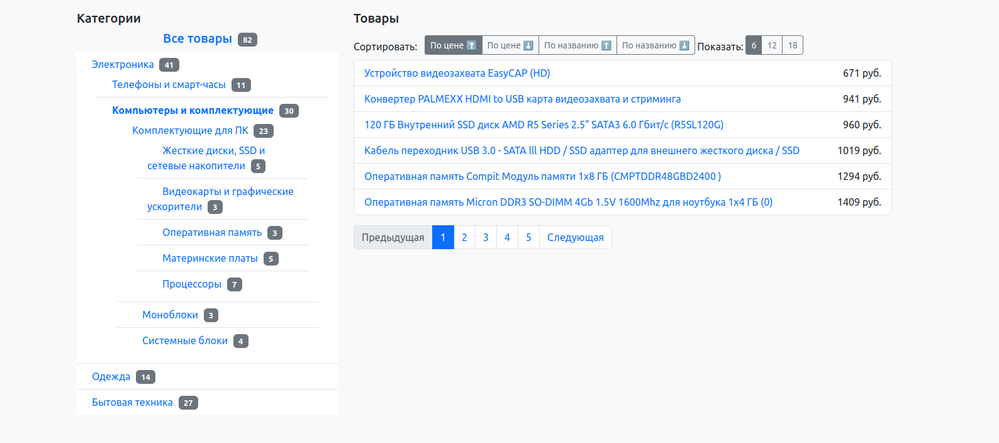

# Запсук с docker(миграции и composer install делаютсясами):

  ```
  docker compose up -d
  ```

## Главная страница: http://localhost:8876
### Вывод товаров по категории: http://localhost:8876/category/1

### Вывод товаров по категории в json: http://localhost:8876/api/category/1/products

### Карточка товара по id: http://localhost:8876/product/1


## Phpmyadmin: http://localhost:8080

##Демо:
